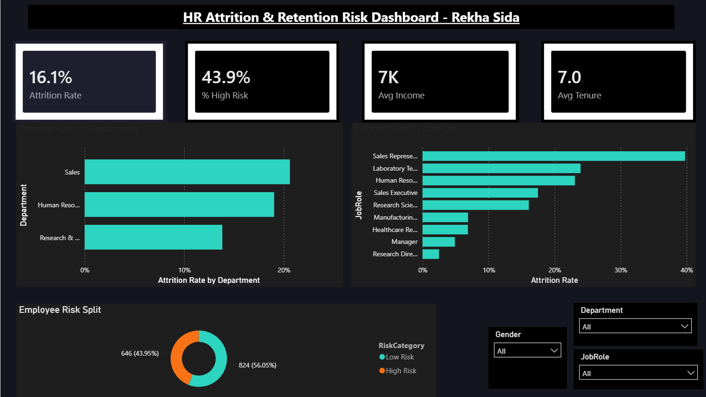
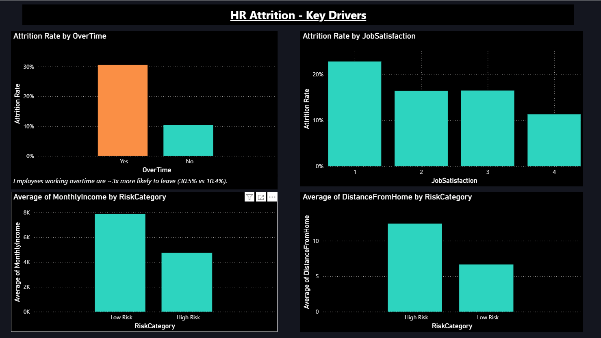

# HR Attrition Analysis & Retention Risk Dashboard

Analysis of the IBM HR Analytics Employee Attrition dataset (1,470 employees) to identify what drives employee attrition, flag at-risk employees, and predict attrition using machine learning.

## 🔧 Tools
Python (pandas, matplotlib, seaborn), SQL (SQLite), Power BI, scikit-learn

## 📊 Key Findings
- **Overtime is the single biggest driver** — 30.5% attrition for employees working overtime vs 10.4% for those who don't (3x difference)
- **Sales Representatives leave at a 39.8% rate** — by far the highest of any job role
- **Sales department (20.6%)** has notably higher attrition than R&D (13.8%)
- **Pay gap**: employees who left earned ₹4,787 on average vs ₹6,833 for those who stayed (~30% gap)
- **Distance matters**: leavers live ~10.6 km from work vs 8.9 km for stayers
- **Tenure**: leavers average 5.1 years at the company vs 7.4 years for stayers
- **Satisfaction is a clean gradient** — attrition drops steadily from 22.8% (satisfaction=1) to 11.3% (satisfaction=4)

## 🚩 Risk Category (Dashboard v1)
For the dashboard, employees are flagged **High Risk** if they meet 2 or more of: works overtime, job satisfaction ≤ 2, income below median, distance from home > 15 km. This is a **rule-based heuristic**, not a model prediction — it's a starting point for the dashboard visuals. Notably, it flags some roles (e.g. Research Scientist) as high-risk more often than their actual historical attrition suggests, showing the limits of a simple rule versus a trained model.

**Dashboard v2** (in progress) replaces this heuristic with real predicted probabilities from the ML model below.

## 📈 Power BI Dashboard
Two pages: **Overview** (KPIs, department/role breakdown, risk split, interactive slicers) and **Drivers** (overtime, job satisfaction, income, and distance comparisons).

## 🗄️ SQL
10 queries covering attrition rate by department/role, risk category breakdowns, income and distance comparisons, and department × risk cross-tabs. See `hr_attrition_queries.sql`.

## 🤖 Machine Learning
Logistic Regression, Random Forest, and XGBoost trained to predict attrition, with class imbalance (~84% stayed / 16% left) handled via `class_weight='balanced'`. Evaluated on accuracy, ROC-AUC, precision, and recall — recall is prioritized since missing a likely leaver is costlier than a false alarm. *(Results to be added.)*

## 📁 Files
- `WA_Fn-UseC_-HR-Employee-Attrition.csv` — raw dataset
- `hr_attrition_clean.csv` — cleaned dataset with engineered RiskCategory
- `hr_attrition_queries.sql` — SQL analysis queries
- `HR_Attrition_Dashboard.pbix` — Power BI dashboard
- `HR_Dashboard.png`, `HR_Drivers.png` — dashboard screenshots

## 👤 Author
Rekha Sida — [GitHub](https://github.com/rekhashida) | [LinkedIn](https://linkedin.com/in/rekha-sida-rs576) | [Kaggle](https://kaggle.com/rekhashida)
